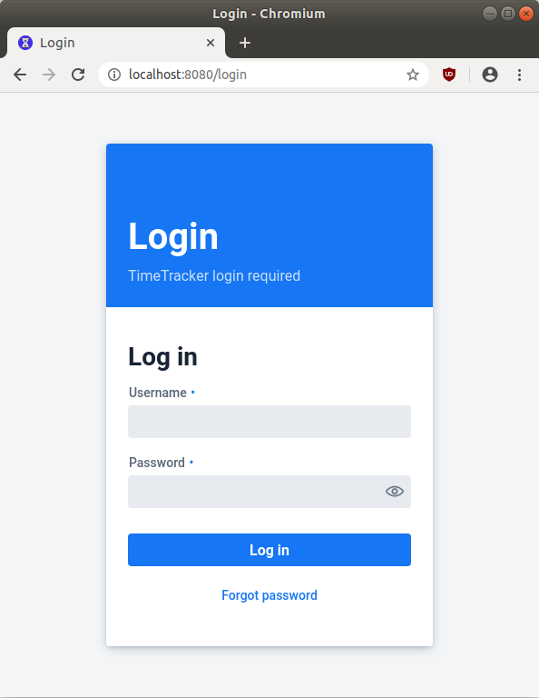

# TimeTracker
TimeTracker is a simple tool for the personal tracking of the time you have spent on projects. It aims primarily at
developers who want to simply track their personal effort spent on projects, but it may be useful also in other cases
when a detailed tracking of time spent is helpful. Hence, TimeTracker allows you to

1. ... simply record your activities in a project on a personal basis (no multi-user TimeTracking).
1. ... create reports for the time spent on a project/phase/task on a daily basis.

TimeTracker is written in Java using [Spring Boot](https://spring.io/projects/spring-boot) and [Vaadin (Flow)](https://vaadin.com/). 
The reporting system uses [JasperReports]()


# Compile the Project and Startup
## Clone from git
```shell script
git clone https://github.com/k0k0pelli/timetracker.git
```

## Compiling with Gradle
The project uses the newest Vaadin technology applying Polymer/Web Components. For compiling the project, 
you need to install version 12.X.Y LTS of NodeJS and NPM, respectively (any other seems not to work together 
with spring boot). Please refer to [NodeJS download site](https://nodejs.org/en/) on how to do this for your 
operating system.

After installing NodeJS, you can create a distribution of your project by using Gradle.
The project uses the Gradle wrapper for compiling creating the distribution package of the Project. So you
do not need to install Gradle yourself.

Change to the directory where you cloned the GIT repo and execute Gradle
```shell script
cd git/timetracker
./gradlew clean build
```
You will find the packaged Spring Boot jar file in the target folder  
(subdirectory `dist/timetracking-X.Y.Z[-SNAPSHOT].jar`, with X.Y.Z denoting the release version).

## Execute the TimeTracking application
The TimeTracking application is a web application. In order to execute it, 
copy the jar file and the shell scripts to a directory of your choice and execute

```shell script
java -jar ./timetracking-X.Y.Z[-SNAPSHOT].jar
```

or use the Shell scripts.

The server will startup on port 8080 @ localhost. The database is automatically created 
inside the startup directory and named `timetracker.mv.db`. So, you need to backup this file.

If you need more information about how to run directly with Gradle or run inside an IDE, please
refer to [the base Vaadin starter project](https://github.com/vaadin/base-starter-spring-gradle).

### Tweaking Parameters
The following default values are set in the 
Parameters that may be of interest to tweak with:

Parameter name | Description | Default value
-------------- | ----------- | -------------
spring.datasource.url | The URL to the `h2` database. This may be set to a database file in a different location, e.g. `jdbc:h2:/home/username/db/mydb` | jdbc:h2:./timetracker
server.port | The server port where the web application is reachable on localhost. | 8080
id.meier.time.tracker.locale.lang | This parameter may be used to override the _language_ locale, which is by default defined by your operating system. | &lt; operating system value &gt;
id.meier.time.tracker.locale.country | This parameter may be used to override the _country_ locale, which is by default defined by your operating system. | &lt; operating system Value &gt;
spring.security.user.name | The name of the user which is allowed to use TimeTracker (Enabling authentication, see next section). | user
spring.security.user.password |  The passwpord of the user which is allowed to use TimeTracker (Enabling authentication, see next section). | password

You may override properties defined for the application in the command line. See
the following [Stackoverflow entry](https://stackoverflow.com/questions/37052857/spring-overriding-one-application-property-from-command-line).

### Protecting your TimeTracker Data
TimeTracker is intended for the personal use on the computer where it is installed. By default, there are no security
mechanisms switched on protecting your data. Thus, it is recommendable that the TimeTracker web application is only 
accessible from your local machine, which can be achieved by defining the necessary Firewall rules on your operating 
system (please check Google for how to do it).

Nevertheless, there may be cases in which you like to access TimeTracker from different devices. In this case, you can 
activate an authentication mechanism and define the credentials for the user which is allowed to sing-in. If you like to 
startup TimeTracker with authentication enbled, use the following command.

### Examples for Starting up TimeTracker

```shell script
java -Dspring.profiles.active=authenticated -jar ./timetracking-0.8-SNAPSHOT.jar
```

In this case, the user must authenticate with the default user and password which are actually `user` and `password`.
It is recommended to change the credentials with the following startup command:

```shell script
java -Dspring.profiles.active=authenticated -jar ./timetracking-0.8-SNAPSHOT.jar --spring.security.user.name=<username> --spring.security.user.password=<password>
```

Substitute `<username>` and `<password>` with your own values.

With enabled authentication, a login dialog appears, when opening the URL of the TimeTracker for the first time:



# Small user guide
This section contains a brief user guide for TimeTracker.

## Data structure Stored by TimeTracker
The time tracking data of TimeTracker is structured in projects, phases, tasks, assignments.
A project consists of several phases, a phase in turn consists of several tasks. Each assignment is
the workload directly processed by you and may be associated with a project, phase, and task.


## Main Menu
The main menu of TimeTracker contains three entries:

* Manage Assignments: This part of the application allows the user to manage the assignments.
* Manage Projects: This part of the application provides an editor for managing projects, phases, and tasks.
* Time Reports: The reporting allows the user to report on the time spent on each project/phase/task, as well as
on a single day. Furthermore, it is possible to create reports on working time blocks.


## Managing Assignments
The following screenshot gives an overview of the assignment management view.


The Assignment View consists of three parts: 
- The options for creating a new assignment. 
- The search part on the upper half of the view.
- The assignment editor on the lower half of the view. 

The screenshot enumerates all the UI elements in the parts:

1.  Options for the creation of a new assignment
    1. `Guess Data of new Assignment` when creating a new Assignment, TimeTracker will 
       search for the project, phase and task that are set the most. These project, phase, and taks are
       set for the new Assignment.
    1.  `Create Assignment by template` when creating a new Assignment, TimeTracker will look for an existing Assignment that is 
       marked with the template name specified in (2). If an assignment is found, project, phase, task, and comment is taken over
       from the existing assignment.   
1. Name of the template used to fill out the new Assignment this is the name which is associated with an 
   existing Assignment. If the option `Create Assignment by template` is set, the project, phase, task and comment
   is taken over from the found Assignment template.
1. `Terminate non finished Assignments` if a new Assignment is saved, any open Assignment which has no end date and time 
   set will be terminated. That means that the current date and time is set as end date and time.
1. `New Assignment` button creates a new Assignment and fills out the data according to the chosen 
   options under (1) - (3). The Assignment editor appears with the new Assignment in the lower half of the view, see items
   (12) - (23). The new Assignment is not saved, but must be saved explicitly. 
1. Selection filter `Start Date`, `Start Time`, `End Date`, `End Time` Any values set in these 
   fields are used to search for Assignments whose start date/time and end date/time include the given
   start and end date/time. 
1. Reset selection date with `Set Filter for today` this button resets the start date/time and end date/time fields 
   for the selection of the Assignments. After resetting, the search date and time for the current day are set.
1. Selection filter for `Project`, `Phase`, and `Task` you may select Assignments which have 
   the selected Project, Phase, and Task set.
1. `Search button` the search button searches the Assignments that match with the given criteria. 
   The results are listed in the result table below. 
1. `Result panel` the result panel shows all found Assignments.
1. `Summary of the found results` the summary of the result list shows the number of Assignments found, 
   as well as the summed up number of hours spent.
1. `Export Results to CSV` this button exports all Assignments shown in the result list to a CSV file
    which can be opened and processed by your favorite spread sheet application. Each assignment is an own
    record (row) in the file. The values of each record are separated by commas.
1. `Start Date` and `Start Time` the start date and start time of edited Assignment.
1. `Set Start` pressing this button fills in the current date and time as start date and time in 
    the currently edited Assignment. 
1. `End Date` and `End Time` the end date, and the end time of the Assignment opened in the editor.
1. `Set End` pressing this button fills in the current date and time as end date and time in 
    the edited Assignment. 
1. `Project` the Project that is associated with the edited Assignment. A new Project is created
    in the selection list, as soon as the selection list loses its focus.
1. `Phase` the Phase that is associated with the edited Assignment. The list from which 
   the Phase can be selected depends on the selected Project.  A new Phase is created
   in the selection list, as soon as the selection list loses its focus.
1. `Task` the Task that is associated with the edited Assignment. The list from which 
    the Task can be selected depends on the selected Phase. A new Task is created
    in the selection list, as soon as the selection list loses its focus.
1. `Description` the detailed description of the edited Assignment.
1. `Clone Template Name` the template name of the Assignment. In case the template name is defined,
   the name may be specified when creating a new Assignment, see option (1.2) `Create Assignment by template`.
   In this case, the Project, Phase, and task, as well as the description of the template Assignment is filled 
   in the newly created Assignment.
1. `Save` saves the edited Assignment.
1. `Delete` Deletes a stored Assignment. This button is not available for newly created Assignments which have not 
    been saved yet.
1. `Cancel` Aborts the editing of an existing Assignment without storing any modified data.

`Note` Search criteria are connected by a logical `AND`. If a criterion is left empty, it is not taken 
into account for finding Assignments.

## Managing Projects/Phases/Tasks
The project management view consists of three sub-views:
- The Project view
- The Phase View
- The Task view

Basically, the Project management view allows to mange the Project meta data, i.e., to add, edit, and delete
Projects, Phases und Tasks.

The following screenshot lists the elements of the Project Management View:


The view elements are described in the following:
1. `New Project` This button creates a new Project and opens it in the Project editor (cf. item 3).
1. `List of existing Projects` This is the list of existing projects which are existing. 
    By selecting a project, it will open in the Project editor panel (cf. item 3) and will
    show the list of Phases that belong to the Project (cf. item 10). 
1. `Project editor` The project editor shows all properties of the selected Project for editing.
1. `Project Name` The name of the Project to be edited.
1. `Project Description` The description of the Project displayed for editing.
1. `Project is active` Indicates whether the Project is active or not. An active project
is shown for selection in the Assignment editor.
1. `Save Project` The Save button saves the edited Project metadata, as well as all 
metadata of associated Phases and Tasks.
1. `Delete Project` The Delete button deletes the Project meta data selected, as well as all 
associated metadata of Phases and Tasks.
1. `Cancel` Aborts the editing of the current Project without saving any changes.
1. `Add Phase` Adds a new Phase for the currently selected Project.
1. `Phases List` This is the list of existing Phases for the currently selected Project. 
By selecting a Phase, it will open in the Phase editor panel (cf. item 11)  and will
show the list of Tasks that belong to the selected Phase (cf. item 20). 
1. `Phase Editor` The phase editor shows all properties of the selected Phase for editing.
1. `Phase Name` The name of the Phase to be edited.
1. `Phase Description` The description of the Phase displayed for editing.
1. `Phase is active` Indicates whether the Phase is active or not. An active phase
is shown for selection in the Assignment editor.
1. `Save Phase` The Save button saves the edited Phase metadata, as well as all 
metadata of associated Tasks.
1. `Delete Phase`  The Delete button deletes the Phase metadata selected, as well as all 
metadata of associated Tasks.
1. `Cancel` Aborts the editing of the current Phase without saving any changes.
1. `Add Task` Adds a new Task for the currently selected Phase.
1. `Task List` This is the list of existing Tasks for the currently selected Phase. 
By selecting a Task, it will open in the Task editor panel (cf. item 21).
1. `Task Name` The name of the Task to be edited.
1. `Task Description`  The description of the Task displayed for editing.
1. `Task is active` Indicates whether the Task is active or not. An active task
is shown for selection in the Assignment editor.
1. `Save Task` The Save button saves the edited Task metadata.
1. `Delete Task` The Delete button deletes the Task metadata selected.
1. `Cancel` Aborts the editing of the current Task without saving any changes.

`Note` If change metadata of a task or a phase, you must also save the project after
saving the task, or the phase, respectively.

## Reports
The Reporting View allows the user to create time reports on a set of selected 
assignments. The following screenshot shows the detail of the reporting view.


The numbered items in the reporting view are:
1. `Search Panel` The search panel helps you to select the assignments for which you
like to create a report. The search panel works the same way as the one in the assignment view
(see above).
1. `Result List` The result list show all the selected assignments for which you 
like to create a report. The displayed information is described in detail
in the assignment view (see above).
1. `Summary` The summery list the total hours spent on the assignments in the result list
as well as the number of assignments.
1. `Export to CSV File` This button allows you to export the selected assignments in the 
result list into a CSV file. The details of this functionality can be found assignment 
view help (see above).
1. `Report Selection` The report selection allows you to select which report for the 
selected assignments will be generated:
   1. `Project` Groups the assignments by the associated Project and outputs the total hours
      spent on each project.
   1. `Project/Phase` Groups the assignments by the associated Project and Phase and 
      outputs the total hours spent on each project and phase.
   1. `Project/Phase/Task` Groups the assignments by the associated Project, Phase, and Task and 
      outputs the total hours spent on the project, phase, and task.
   1. `Working day` Groups the assignments for each working day and 
      outputs the total hours spent per day.
   1. `Working periods` Groups the assignments by contiguous periods and 
   outputs the total number of hours spent per contiguous time period.
1. `Generate Report` This button causes the selected report to be generated. The report file
   is downloaded as pdf.


